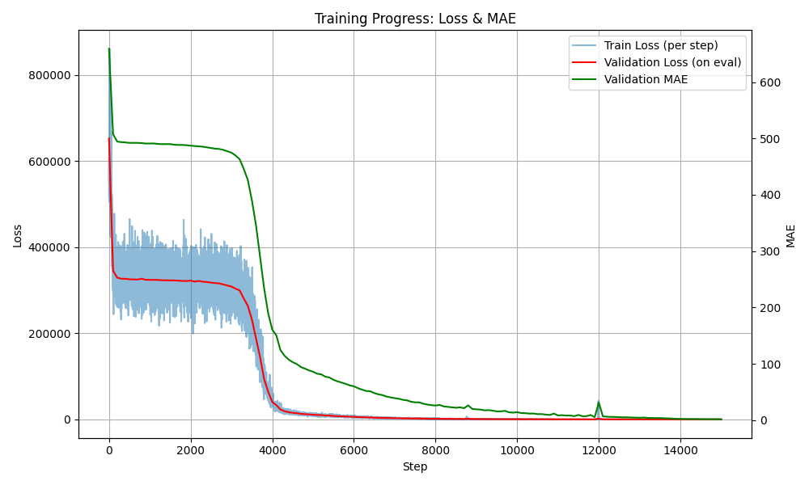
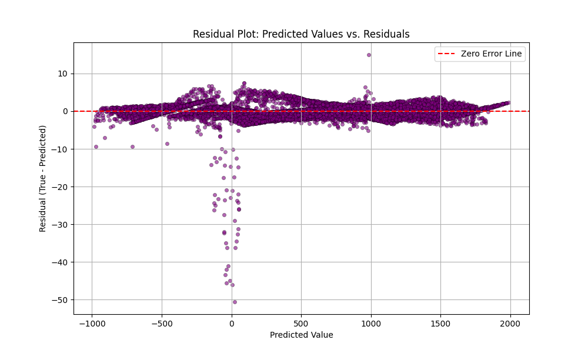
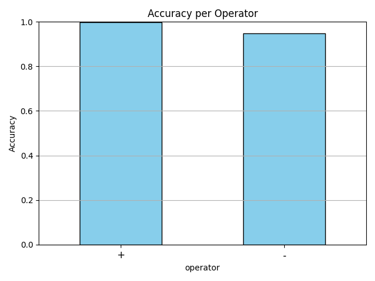
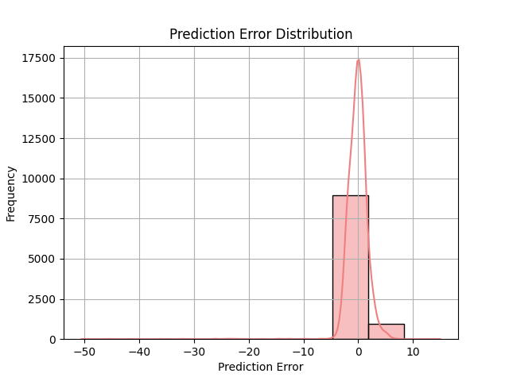

# Calculator-ML

This project demonstrates how a **neural network** can simulate a basic calculator. It serves as an **educational tool** to explore how **Artificial Neural Networks (ANNs)** learn to perform arithmetic operations like addition and subtraction through structured data and training.

---

## Objective

Train a neural network to predict the result of a basic arithmetic expression composed of:

* **Numerator (`a`)**: Integer between 1 and 1000
* **Operator (`op`)**: Either addition (+) or subtraction (-)
* **Denominator (`b`)**: Integer between 1 and 1000

Given a, op, and b, the network learns to predict a + b or a - b.

---

## Dataset Generation

The dataset is generated using `data_generation.py`. It produces **10,000 examples**, each consisting of:

* Random integers `a` and `b` between 1 and 1000
* A randomly chosen operator (`+` or `-`)
* A **computed result** using Python's `eval()` function

Each line in the CSV file looks like this:

```
numerator,operator,denominator,result
42,+,58,100
75,-,50,25
```

---


## Model Architecture

Operators are encoded using **one-hot encoding** to treat them as categorical variables:

```
+ → [1, 0]
- → [0, 1]
```

This approach ensures:

* Operators are treated as **categorical**, not ordinal
* The model learns distinct rules for each operator independently
* No bias due to positional proximity (e.g. `+` vs `-`)

### Model Type
### Network Structure

A simple **fully connected feedforward network** (ANN) is used, with:

* **Input size**: 4 (numerator + operator one-hot + denominator)
* **Hidden layers**: 3 layers with 32 → 16 → 16 neurons
* **Activations**: ReLU activation for non-linearity
* **Output**: A single neuron predicting the result (regression)
* **Loss**: Mean Squared Error (MSELoss)
* **Optimizer**: Adam

Although, this project uses an **Artificial Neural Network (ANN)** since the input is a **fixed-length vector** (not sequential data)

---

## Technical Justification

| Component               | Choice         | Justification                                                            |
| ----------------------- | -------------- | ------------------------------------------------------------------------ |
| **Input Size**          | 4 features     | Numerator (1) + Operator one-hot (2) + Denominator (1)                   |
| **Hidden Layers**       | 32+ 2 × 16 neurons | Sufficient to model  without overfitting |
| **Activation**          | ReLU           | Fast, efficient, avoids vanishing gradients                              |
| **Output Layer**        | 1 neuron       | Predicts a single continuous result                                      |
| **Loss Function**       | MSELoss        | Ideal for regression; penalizes large errors more heavily                |
| **Optimizer**           | Adam           | Adaptive learning rate, no manual tuning required                        |
| **Steps / Batch Size** | 15000 / 64       | Balanced training time and stability for small datasets                  |

---

## Training

The training loop is implemented using **PyTorch** with step-by-step logging and evaluation:

* **Batch size**: 64
* **Training steps**: 15000
* **Evaluation every**: 100 steps
* **Tolerance threshold**: 5% (for accuracy metric)

Metrics tracked include:

* Training loss (MSE)
* Validation loss
* Mean Absolute Error (MAE)
* Tolerance-based accuracy

---

## Results

After training, the model is evaluated using several visual plots

<div style="display: flex; flex-wrap: wrap; justify-content: space-between; gap: 10px;">
  
  
  
  
</div>


---

## How to Run


```bash
# 1. Generate a balanced dataset with + and -
python data_generation.py

# 2. Train the model using PyTorch
python train.py
```

Output files (plots and model checkpoint) will be saved in the `output/` and `models/` directories.

Claro, aquí tienes una versión mejor redactada y más clara de esa sección:

---

## Notes

This project is designed purely for **educational purposes**, with the goal of demonstrating how neural networks can learn simple mathematical patterns through data.

### Potential Future Improvements

* Extend support to additional operators such as `*`, `/`, and `**` using ditribution normalization on dataset 
* Enable learning with **multi-digit** and **larger numerical ranges**
* Add support for **floating-point numbers** to improve real-world applicability
* Implement **expression parsing** for multi-step operations (e.g., `a + b * c`)
* Compare performance with **symbolic approaches** (e.g., using eval vs learned)

---

## Folder Structure

```
.
├── data_generation.py
├── train.py
├── data/
│   └── dataset.csv
├── model/
│   └── calculator_model.pth
├── output/
│   ├── accuracy_per_operator.png
│   ├── error_distribution.png
│   ├── loss_curve.png
│   └── residual_plot.png
```

---

## Author

Created by **Francisco José Martín**
Feel free to reach out for ideas, feedback, or collaboration!
